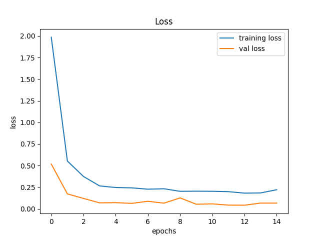
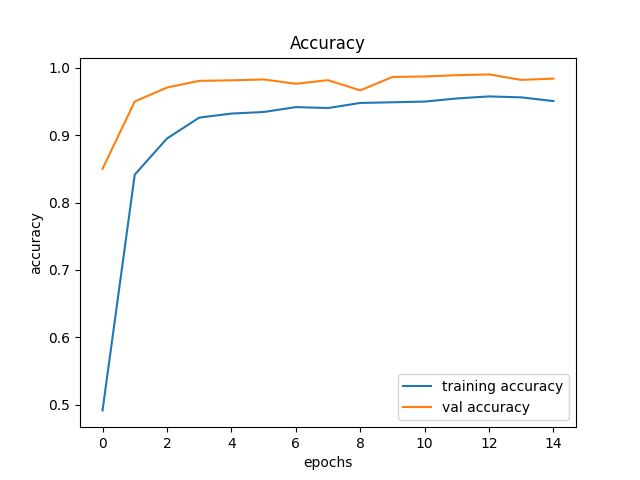

# Traffic Sign Recognition (Deep Learning, ~99% Accuracy)

A convolutional neural network (CNN)-based system for classifying traffic signs into 43 categories using the GTSRB dataset. The project includes a full training pipeline and a GUI for real-time predictions.

---

## Features

* 43-class traffic sign classification
* CNN-based deep learning model (TensorFlow/Keras)
* End-to-end pipeline: preprocessing → training → evaluation
* GUI for real-time image prediction
* High performance with fast convergence

---

## Results

### Training vs Validation Loss



### Training vs Validation Accuracy



### Performance Summary

* Validation Accuracy: **~98.5–99%**
* Training Accuracy: **~95–96%**
* Validation Loss: **~0.05–0.08**
* Training Loss: **~0.18–0.22**

### Observations

* Rapid convergence within first **5–10 epochs**
* Minimal overfitting (stable validation curves)
* Strong generalization performance

---

## Project Structure

```
Traffic_sign_classification/
│
├── src/
│   ├── train.py          # Model training script
│   ├── gui.py            # GUI for predictions
│
├── models/               # Saved models 
│   ├── my_model.keras    
│   ├── traffic_classifier.keras    
|
├── data/                 
│   ├── Meta
|   │   ├──        # images and info
│   ├── Test
|   │   ├──        # images
│   ├── Train  
|   │   ├──        # images
│   ├── Meta.csv  
│   ├── Test.csv  
│   ├── Train.csv  
│
├── results/               # Images for README
│   ├── Accuracy.png  
│   ├── Loss.png  
│
├── requirements.txt
├── README.md
├── .gitignore
```

---

## Setup Instructions

### 1. Install Python

Recommended version: **Python 3.10 or 3.11**

```bash
winget install Python.Python.3.11
```

---

### 2. Clone the Repository

```bash
git clone https://github.com/priyanshugithub2003/Traffic_sign_Recognition.git
cd "Traffic_sign_Recognition"
```

---

### 3. Create Virtual Environment

```bash
py -3.11 -m venv tf_env
tf_env\Scripts\activate
```

---

### 4. Install Dependencies

```bash
pip install --upgrade pip
pip install -r requirements.txt
```

---

## Dataset Setup

Download the GTSRB dataset:

https://www.kaggle.com/datasets/meowmeowmeowmeowmeow/gtsrb-german-traffic-sign

After downloading, place files as:

```
data/
├── Train/
├── Test/
├── Meta/
├── Train.csv
├── Test.csv
├── Meta.csv
```

---

## Usage

### Train the Model

```bash
python src/train.py
```

This will:

* Load dataset from `data/`
* Train CNN model
* Save trained model in `models/`
* Output accuracy and loss metrics

---

### Run GUI for Prediction

```bash
python src/gui.py
```

Steps:

1. Upload an image
2. Click **Classify Image**
3. View predicted traffic sign

---

## Model Details

* Architecture: Convolutional Neural Network (CNN)
* Framework: TensorFlow / Keras
* Input: Traffic sign images
* Output: 43-class classification

---

## Workflow

1. Clone repository
2. Setup environment
3. Download dataset
4. Train model
5. Run GUI

---

## License

This project is for educational and research purposes.
